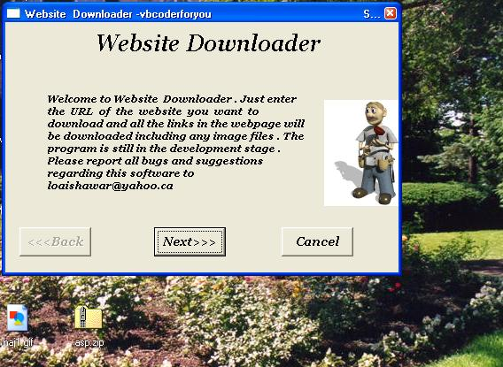



## Website Downloader

### Description

I solve Error

Just enter the URL of the website you want to download and all the links in the webpage will be downloaded including any image files .

U need not type in the whole url i.www.xyz.com will do

:) Vote if you like it

u can select the type of files you want to download

u can select how many files you want to download.

U can download asp files.
 
### More Info
 

             |
---                |---
**Submitted On**   |2002-06-12 18:19:52
**By**             |[dotNETCoderforYou](https://github.com/Planet-Source-Code/PSCIndex/blob/master/ByAuthor/dotnetcoderforyou.md)
**Level**          |Advanced
**User Rating**    |3.6 (18 globes from 5 users)
**Compatibility**  |VB 6\.0
**Category**       |[Complete Applications](https://github.com/Planet-Source-Code/PSCIndex/blob/master/ByCategory/complete-applications__1-27.md)
**World**          |[Visual Basic](https://github.com/Planet-Source-Code/PSCIndex/blob/master/ByWorld/visual-basic.md)
**Archive File**   |[Website\_Do935226122002\.zip](https://github.com/Planet-Source-Code/dotnetcoderforyou-website-downloader__1-35753/archive/master.zip)

